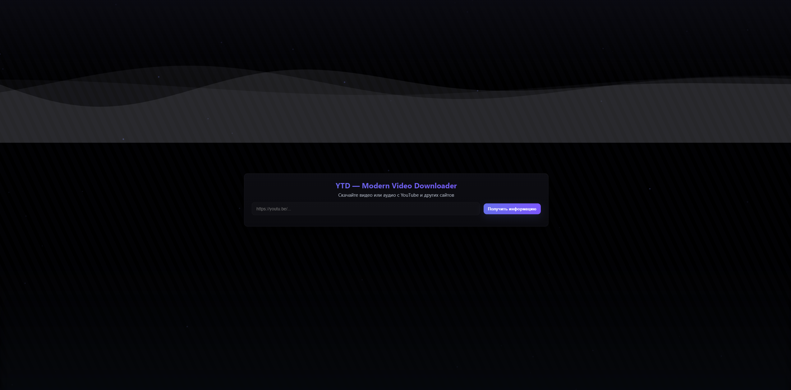
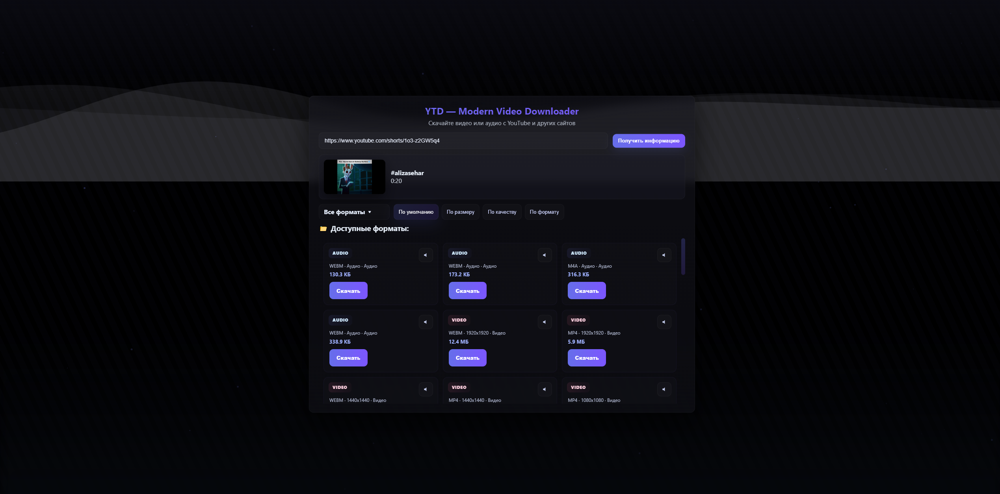

# 📥 YT-DL Web UI

[](#)
[](LICENSE)
[](#)

✨ Удобный и современный веб-интерфейс для скачивания **видео и аудио с YouTube**. Красивый UI, поддержка разных форматов и простота использования.

---

## 📸 Скриншоты



---

## 🚀 Возможности
- 🎬 Скачивание видео в любом доступном качестве (360p, 720p, 1080p, 4K+)
- 🎵 Отдельное скачивание аудиодорожек (MP3 / M4A / Opus)
- 🖼 Минималистичный и адаптивный интерфейс
- 🛡 Полностью локальная работа — никакие данные не уходят наружу
- ⚡ Быстрая обработка с помощью `yt-dlp`

---

## ⚡ Установка

```bash
git clone https://github.com/Kevanko/YTD.git
cd YTD
```

## Установка Python (если ещё не установлен)
```bash
# Debian/Ubuntu
sudo apt install python3-pip
# Fedora
sudo dnf install python3-pip
# macOS (Homebrew)
brew install python

# Проверка версии Python
python3 --version
```

## Установка yt-dlp
```bash
pip install -U yt-dlp
yt-dlp --version
```

## Установка ffmpeg
```bash
# Debian/Ubuntu
sudo apt install ffmpeg
# Fedora
sudo dnf install ffmpeg
# macOS
brew install ffmpeg
```
## Запуск приложения
```bash
python3 add.py
```

## После запуска открой в браузере:
👉 http://127.0.0.1:5000
👉 localhost:5000
