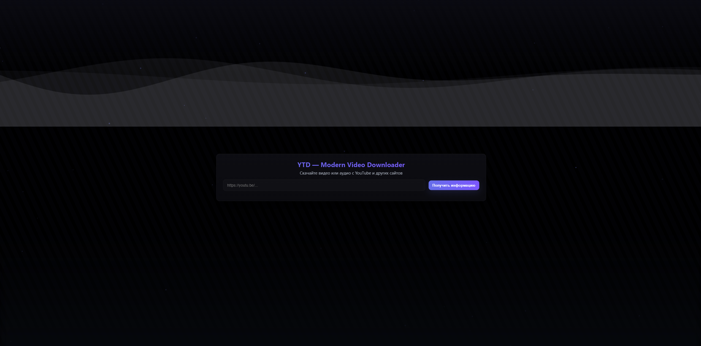
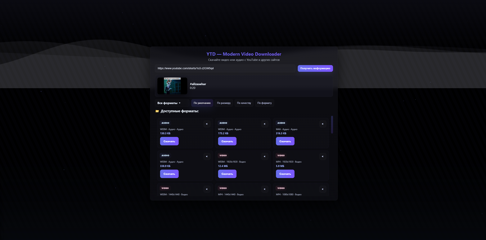

# YTD

Flask-based web UI for downloading YouTube video and audio in multiple formats.

## Overview

This project provides a lightweight browser interface for submitting a YouTube link and downloading media in a user-friendly way.

## Structure

- `app.py` - Flask application entry point
- `templates` - HTML templates
- `static` - CSS and static assets
- `screens` - interface screenshots

## Stack

Python, Flask, HTML, CSS.

## Screenshots

## Notes

This repository is a compact educational web project with a strong demo-friendly interface.
